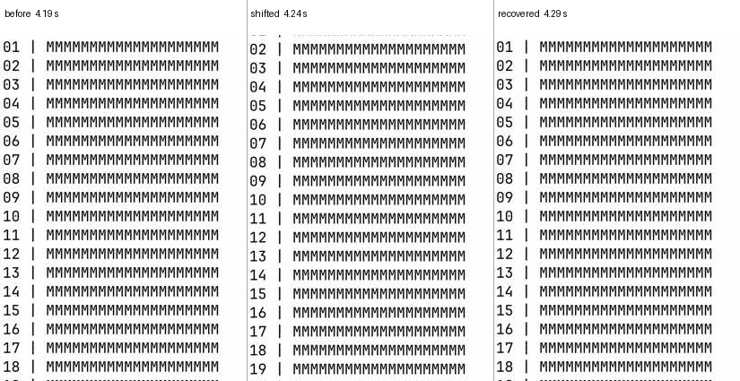

# Resize flicker: investigation and fix

The three fixes described here shipped in
[libghostty-spm 1.6.20260922](https://github.com/Lakr233/libghostty-spm/releases/tag/1.6.20260922),
using Ghostty `3c47ca159368` and XCFramework revision
`upstream.3c47ca159368-2`. The captures below are from the investigation;
the release build passed the upstream XCFramework build and package checks.

## Pixel capture

`Scripts/resize-glitch-detector.py` samples the vphone virtual display through
its host control socket. The frames are compositor output, not PTY text or
view snapshots. It timestamps every frame and reports transient ink loss,
brightness changes, missing bands, and pixels that change then return. Each
finding has before / suspect / after images, `metrics.csv`, and `report.json`.

Use a fixed crop containing terminal text and excluding app controls and the
right edge that the resize itself moves. For the bottom rows of the tested
430×932 display:

```sh
python3 Scripts/resize-glitch-detector.py capture \
  --output /private/tmp/resize-capture --duration 25 --fps 60
python3 Scripts/resize-glitch-detector.py analyze \
  /private/tmp/resize-capture --roi 0.02,0.64,0.58,0.82 \
  --baseline-start 2 --analyze-from 6 --stable-content
```

For a controlled run, fill the screen with numbered lines shorter than the
smallest test width and leave a silent program such as `sleep 120` in the
foreground. `Scripts/resize-repro/static.sh` does this; the prompt and
synchronized-output cases have neighboring scripts. The `--stable-content`
mode compares every frame to the settled baseline and flags a loss of at
least 65% of its text ink. It is for fixed content only; the generic mode
uses local before/after comparisons. Give a one-line prompt its own narrow
crop, or other rows will dilute its disappearance. The detector keeps line
bands at least eight pixels high, so cursor blinking in a narrow crop does
not count as a lost row. The iPhone vphone has no resize handle.
`Scripts/resize-glitch-probe.patch` temporarily animates a 0–90 pt right
inset four times, starting three seconds after the terminal mounts.
`Scripts/resize-glitch-zero-throttle.patch` makes foreground programs use
0 ms during that experiment; the normal app uses 128 ms for them. Apply the
animation patch to a clean checkout, add the zero-throttle patch for the
0 ms runs, and add `Scripts/resize-glitch-state-probe.patch` when correlating
pixels with the grid. Build and install a test `.deb`, copy a fixture from
`Scripts/resize-repro/` or the delayed-prompt fixture
`Documents/CaseStudy/resize-flicker/slow-prompt.sh` to vphone,
run it in an installed iGhostVT session through `ighostvt-cli send`, then
terminate and relaunch the app while capturing so the animation runs over
already settled content. Restore the three source files before building a
normal package. The tested grid varied between 43×37 and 34×37.

The detector found a deliberately inserted 90 ms erase and redraw, and found
zero events in a 181-frame static baseline. A 120 fps request through this
vphone API still delivered about 60 frames per second. A flash shorter than
one sampled interval can escape; an empty report is not proof of no flash.
JPEG grayscale can also miss color-only defects. Inspect the contact sheets
and repeat with both a bottom-row crop and a full stable-text crop.

## Reproduced one-row displacement

All runtime A/B runs used `.deb` packages installed on vphone. They drew the
same static numbered primary screen with `sleep` in the foreground, a 128 ms
resize throttle, and four identical inset animations. The app's temporary
`CADisplayLink` probe recorded the UIKit view, Ghostty sublayer frame,
`contentsScale`, and presented IOSurface dimensions each display tick.

| Library build | Display frames | Bottom-crop findings | Scale excursions | Wrong IOSurface height |
| --- | ---: | ---: | ---: | ---: |
| Released libghostty-spm 1.6.20260909 | 1,500 | 3 | 4 | 4 |
| Same source with stale-frame guard | 1,501 | 0 | 0 | 0 |

The normal layer was 783 pt high at scale 3, so its target height was 2349
pixels. In one resize the released library accepted a stale 1057 px wide
IOSurface for a 342.5 pt layer and changed `contentsScale` to 3.086131. That
made the *next* target approximately 2416 px high despite no height change.
Other wrong heights were 2409–2413 px. The corresponding captured pixels
showed a one-row shift that returned with no PTY output from `sleep`:



The cause is in libghostty-spm's iOS
`Patches/ghostty/0005-ios-metal-rendering.sh`: its `IOSurfaceLayer` patch
accepts frames with arbitrarily mismatched dimensions and recalculates the
layer's `contentsScale` from the old surface width and height. Ghostty's
`Metal.surfaceSize()` then reads layer bounds multiplied by that scale to
allocate the next render target. The library normally anchors the old frame
at the top-left while waiting for a new frame, but changing its scale defeats
that geometry. A fixed library build rejects frames whose dimensions differ
by more than one pixel, retaining the last presented contents until a matching
frame finishes. The stale-frame guard is included in the released package
above and is now used by normal iGhostVT builds.

Earlier 0 ms runs had no displacement while 128 ms runs did. That correlation
made throttling look like the cause. The library A/B at the *same* 128 ms
setting shows the stale-frame scale change is the immediate cause. The app's
existing resize policy is therefore unchanged; the experimental alternate-
screen mode tracker was removed.

## Prompt last-line blink

All runs below used installed vphone `.deb` packages with the same 0 ms
resize throttle, 0–90 pt four-cycle animation, and a real zsh prompt on the
bottom row. `Scripts/resize-repro/prompt.sh` printed 45 short lines and
returned to the interactive shell. The prompt's fixed crop was
`--roi 0,0.879,0.45,0.902 --stable-content` on the 430×932 display.

| OSC 133 prompt setting | Display frames | Prompt-blank frames | Grid samples without prompt |
| --- | ---: | ---: | ---: |
| Bundled zsh integration (default redraw) | 1,498 | 4 | 4 |
| `OSC 133;A;redraw=0` before the next prompt | 1,498 | 0 | 0 |

The four blank screenshot frames each had zero text pixels in the prompt band
while the 36 numbered rows stayed visible; the prompt returned on the next
sample. Separately, the grid sampler recorded four 37-to-36-row changes,
losing exactly the prompt's 15 nonspace bytes (879 to 864), while an IOSurface
remained attached. The display and grid samplers are independently clocked,
so their four hits are not the same four instants. The narrow-crop detector
reported exactly 4 versus 0 events; a broad crop missed the prompt because
the other rows stayed intact.

`Terminal.resize()` passes `shell_redraws_prompt` to
`Screen.clearPromptForRedraw()`. On a semantic prompt or input line it clears
the prompt cells **before** the shell redraw arrives. The bundled zsh
integration emits `OSC 133;A` without a `redraw` option; the terminal default
is `true`. Sending `redraw=0` keeps the old prompt visible and eliminated the
measured blink. This setting was a diagnostic control. The released fix still
clears the grid for reflow, but the renderer holds its last frame until the
shell redraws the prompt and input, with a bounded wait. That avoids leaving
stale text behind for multiline or edited input.

## Whole-screen clear during synchronized repaint

`Scripts/resize-repro/sync-clear.sh` fills an alternate screen with 32 lines.
Each cycle starts DEC 2026 synchronized output, clears the grid, waits 120 ms,
repaints all lines, and ends synchronization. With no resize, the renderer
holds the previous complete frame throughout the empty-grid phase. With the
same resize animation, the released Ghostty code resets synchronized-output
mode in `Terminal.resize()` on **every** valid resize, including pixel-only
ones; `renderer/generic.zig` then stops skipping renders and presents the
empty intermediate grid. The app's view and IOSurface remain alive.

| Build and condition | Frames after startup | Full-clear frames |
| --- | ---: | ---: |
| Released library, no resize | 660 | 0 |
| Released library, resize | 1,188 | 259 |
| Stale-IOSurface guard only, resize | 1,190 | 272 |
| Guard plus preserved sync mode, resize | 1,164 | 0 |

The fixed text crop was pixels `x=0..230, y=70..730`; a full-clear frame had
zero dark text pixels against a baseline of 22,946. In the guard-only run,
272 blank frames formed 43 detected episodes, typically about 100 ms each.
Both the failing and fixed runs sampled an empty grid more than 1,000 times
during synchronized transactions, and neither lost its IOSurface. Only the
failing build displayed those intermediate grids. The preserved-sync build
kept the old complete image until the program ended DEC 2026. Ghostty's
existing termio watchdog still releases a transaction after one second if
the program does not end it. The fix shipped in the package above.

This confirms a full-screen clear mechanism for a program using DEC 2026.
Whether a specific Codex/Claude version uses that sequence, or sends an
ordinary unsynchronized `CSI 2J` followed by delayed output, still needs a
timestamped PTY trace of that program. Heavy device load increases the gap
before the shell or TUI redraws, so it makes both blank intervals easier to
see. It also increases the chance of a stale IOSurface reaching the display
callback. Those are three separate paths: prompt clearing, synchronization
reset, and stale surface geometry.

## Correlating pixels with internal state

`Scripts/resize-glitch-state-probe.patch` is a test-only app patch. It samples
the active grid's nonblank row/byte counts and the presented IOSurface
dimensions, identity, and scale at each display tick, and flushes the CSV
every second for a 30-second run in the app's Documents directory. Match its
epoch timestamps to each capture frame's `epoch_s`. A screenshot that clears
with a populated grid points to presentation; an empty grid with a valid
IOSurface points to terminal content or PTY output. The grid read adds CPU
load, so repeat a finding without the probe to measure its natural frequency.
Apply this patch and the resize animation only to a test `.deb`, then reverse
both before a normal package.

## Final A/B on vphone

The final probe used the same app source and four 0–90 pt resize animations
for each arm. Only the library differed. A deliberately slow shell emitted
OSC 133 B 150 ms after SIGWINCH, making the prompt gap visible at about 60
sampled frames per second. The real zsh gap was too short for three control
runs to catch reliably, so the fixture tests the frame-hold mechanism rather
than the timing of a normal zsh prompt.

| Case | Released 1.6.20260909 | Fixed test library |
| --- | ---: | ---: |
| Delayed prompt, blank prompt row | 398 / 1,201 frames | 0 / 1,201 frames |
| DEC 2026 clear and repaint, blank fixed text area | 291 / 1,201 frames | 0 / 1,200 frames |

The detector's `--stable-content` prompt report missed the blank row in this
run; the counts above come directly from `metrics.csv` (`ink_fraction = 1.0`
for an empty row) and inspection of captured frames. The clean app package
was installed on vphone after removing the temporary instrumentation. These
numbers describe the test library from that run; the published revision adds
bounded redraw handling and focused regression tests, and has not been
remeasured on the device.
